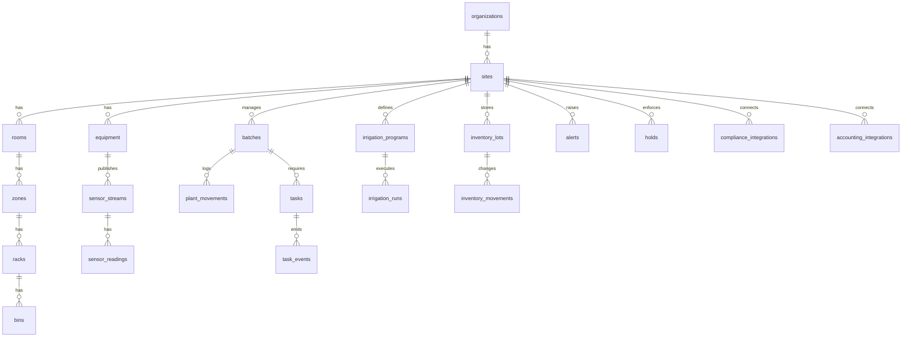

# High-Level ERD (Mermaid)

```mermaid
erDiagram
  organizations ||--o{ sites : has
  sites ||--o{ rooms : has
  rooms ||--o{ zones : has
  zones ||--o{ racks : has
  racks ||--o{ bins : has
  sites ||--o{ equipment : has
  equipment ||--o{ sensor_streams : publishes
  sensor_streams ||--o{ sensor_readings : has
  sites ||--o{ batches : manages
  batches ||--o{ plant_movements : logs
  batches ||--o{ tasks : requires
  tasks ||--o{ task_events : emits
  sites ||--o{ irrigation_programs : defines
  irrigation_programs ||--o{ irrigation_runs : executes
  sites ||--o{ inventory_lots : stores
  inventory_lots ||--o{ inventory_movements : changes
  sites ||--o{ alerts : raises
  sites ||--o{ holds : enforces
  sites ||--o{ compliance_integrations : connects
  sites ||--o{ accounting_integrations : connects
```
